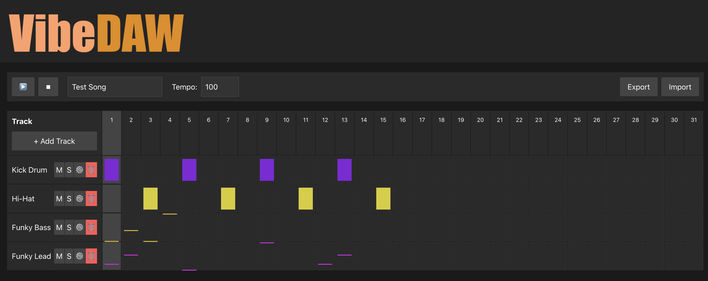

# VibeDaw  



A web-based digital-audio-workstation (DAW) that lets you sequence drums & synths directly in the browser **and** call AI (Anthropic Claude) to generate new instruments or full tracks on the fly.

---

## ✨ Features

* Step-sequencer (64-step / 4-bar grid)
* Sampler & basic synthesiser engines (Web Audio)
* Click-to-edit drum steps; coloured tracks; per-track mute/solo/Delete
* Smooth looping + pop-free envelopes & master compressor
* AI prompt workflow – generate a brand-new track with natural-language (via Anthropic API)
  * Song context, style, mood & available drum samples are sent in the prompt
* Instrument settings modal (volume / pan / waveform / sample selector)

---

## 🚀 Install & Run

```bash
# 1. clone & install
git clone https://github.com/joshburke/vibedaw.git
cd vibedaw
npm install            # or pnpm / yarn

# 2. provide Anthropic key (Claude)
cp .env.example .env   # then edit .env
#   .env   →  ANTHROPIC_API_KEY=sk-...

# 3. start dev server
npm run dev            # Vite dev server with proxy → http://localhost:5173
```

`vite.config.ts` exposes a **dev-only proxy** so the browser calls `/api/anthropic`; Vite forwards it to `https://api.anthropic.com` and injects the secret header.  In production you should proxy through your own backend or serverless function.

---

## 🔮 Future extensions

| Idea | Notes |
| --- | --- |
| Prompt to *edit* sequences | Re-use the prompt pipeline in *sequence* mode so users can say "make this bassline more syncopated". |
| More instrument parameters | Filter envelope, LFOs, reverb, etc. Expose in settings modal & pass to AI prompts. |
| Filter-/FX-chaining | Per-track Web Audio node chains (e.g. drive → eq → delay). Allow drag-to-re-order & save in song JSON. |

---

## 📄 License

MIT License — free to use, modify & distribute.  See [LICENSE](LICENSE) for full text.
